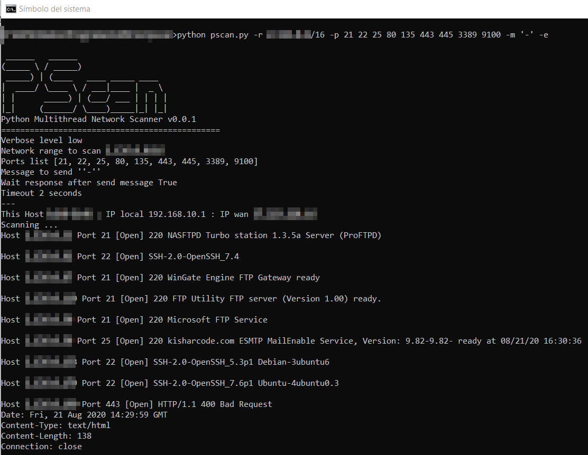

# Python Multithread Network Scanner
     ______   ______                   
    (_____ \ / _____)                  
     _____) | (____   ____ _____ ____  
    |  ____/ \____ \ / ___|____ |  _ \ 
    | |      _____) | (___/ ___ | | | |
    |_|     (______/ \____)_____|_| |_|

NMAP is by far one of the best tools for mapping a network, discovering services, and testing for vulnerabilities. That I am not going to discuss with anyone.

But as a programmer, no one can argue with me the pleasure of being able to create your own tool. You better understand many processes, the way things work, and you have control over parts that you can adapt to your needs.

So, while still being able to use NMAP, I have created a simple program to scan ports in an IP range. It is not perfect, but it is functional, and it is also multithreaded, being able to do a network scan with quite acceptable response times.

    usage: pscan.py [-h] [-r RANGE] [-w] [-p PORTS [PORTS ...]] [-m MESSAGE] [-e]
                [-t TIMEOUT] [-i DELAYBETWEENIP] [-o DELAYBETWEENPORT]
                [-d MAXTHREADS] [-v {0,1,2,3,4,5}] [-l]

    Python Multithread Network Scanner v0.1.0
    
    optional arguments:
      -h, --help            show this help message and exit
      -r RANGE, --range RANGE
                            Specify the network range in CIDR format. If not provided, an attempt is made to autodetect a local class C range. Example: 192.168.1.0/24
      -w, --wanauto         If this option is set (and no -r has been specified), an automatic class C range will be set for the current Wan IP.
      -p PORTS [PORTS ...], --ports PORTS [PORTS ...]
                            Specify a list of ports to scan. Default value: [21, 22, 25, 80, 110, 3389, 9100]
      -m MESSAGE, --message MESSAGE
                            Message to send to host. If empty (-m ''), then not message is sent.
      -e, --waitresponse    Wait response from host after sending Message (if sent). If this is enable then only ports with response are shown Default value: False
      -t TIMEOUT, --timeout TIMEOUT
                            Timeout in seconds on port connection. Default value: 2
      -i DELAYBETWEENIP, --delaybetweenip DELAYBETWEENIP
                            Delay in milliseconds (enter integer) between IP threads. Default value: 20
      -o DELAYBETWEENPORT, --delaybetweenport DELAYBETWEENPORT
                            Delay in milliseconds (enter integer) between PORT threads. Default value: 5
      -d MAXTHREADS, --maxthreads MAXTHREADS
                            Maximum number of simultaneous threads. Default value: 16384
      -v {0,1,2,3,4,5}, --verbose {0,1,2,3,4,5}
                            Debug verbose to console when testing.
                            Default value: 0
                             0 = No verbose
                             1 = CRITICAL
                             2 = ERROR
                             3 = WARNING
                             4 = INFO
                             5 = DEBUG
      -l, --logtofile       If set, log messages are saved in a file named pscan.log instead of on screen.
    
    Simple scanning of specific ports in a network range.
    
    
 
    
 ### Contact

Any suggestion or contribution is welcome. Feel free to contact me if you have any comments.

Twitter: [@310hkc41b](https://twitter.com/310hkc41b)
 